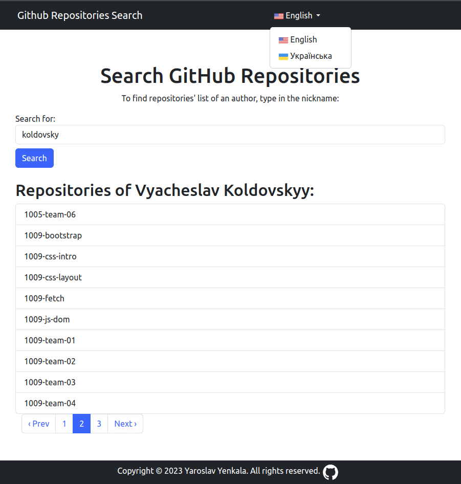

# README

## Screenshot of the app:


## Link to deployed app:

https://githubsearcherbynickname-production.up.railway.app/

## Requirements

Make sure you have the following installed on your system:

- Ruby version 3.2.2
- Bundler

## Installation

1. Clone the repository:

```bash
git clone git@github.com:yaroslavrick/github_searcher_by_nickname.git
```

2. Move into the project directory:

```bash
cd github_searcher_by_nickname
```

3. Install dependencies using Bundler an Yarn:

```bash
bundle install && yarn install
```

4. Create .env and .database.yml file from examples and update the values:

```bash
cp .env.example .env
```

```bash
cp config/database.example.yml config/database.yml
```

5. Setup Docker services (PostgreSQL and Redis):

```bash
docker-compose up
```

Ensure that the ports configured in `.env` do not conflict with your running services.

6. Create the database:

```bash
bundle exec rails db:create
```

7. Run database migrations:

```bash
bundle exec rails db:migrate
```

8. (Optional) Run seed data to create some sample data:

```bash
bundle exec rails db:seed
```

## Usage

To start the app, run the following command:

```bash
bin/dev
```

or:

```bash
bundle exec rails server
```

Once the server is running, open your web browser and go to <http://localhost:3000> to access the app.

## Testing

To run the test suite, use the following command:

```bash
bundle exec rspec
```

## Linting

To run the rubocop linter, use the following command:

```bash
bundle exec rubocop
```

To run json eslint, use the following command:

```bash
yarn lint
```


## Task

The main task is to make a form in Rails that search in github by username.
The result must be "full name" and list of user's repos.

### Example:

    user: dhh

Result:

    David Heinemeier Hansson
    - asset-hosting-with-minimum-ssl
    - conductor
    - textmate-rails-bundle

## Done:

- Searching by username in github.com, Task was to parse with GraphQL, but I make it with gem 'faraday'...

  Display search results:

* Name of author
* List of repositories

- Use GitHub flow (https://docs.github.com/en/github/collaborating-with-issues-and-pull-requests/github-flow#following-the-github-flow)
- Deploy app: ([https://yaroslav-yenkala-gitsearcher.herokuapp.com/](https://githubsearcherbynickname-production.up.railway.app/))
- Add linter rubocop (https://github.com/rubocop/rubocop)
- RSpec-rails tests (https://github.com/rspec/rspec-rails)
- Use vcr for requests to external API in rspec (https://github.com/vcr/vcr)

## Todo:
- Learn GraphQL and make a task with it (https://github.com/rmosolgo/graphql-ruby)
